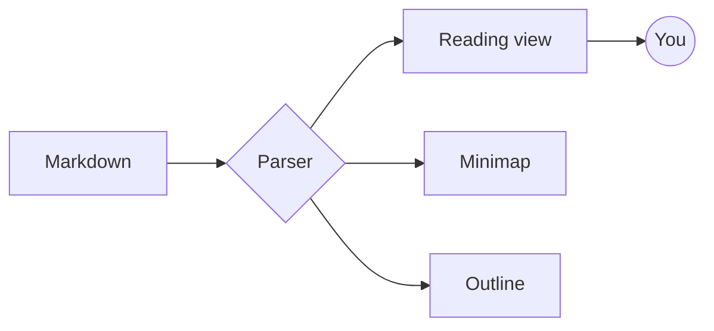

# Images and Diagrams

Images are drawn inline, right where they appear in the text.

## Request Flow

Mermaid code blocks are rendered as diagrams inside the code panel.

```mermaid
flowchart LR
    A[Markdown] --> B{Parser}
    B --> C[Reading view]
    B --> D[Minimap]
    B --> E[Outline]
    C --> F((You))
```
